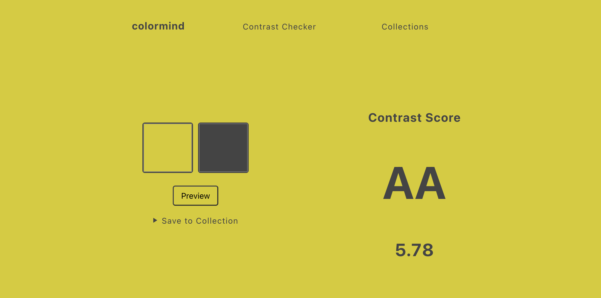
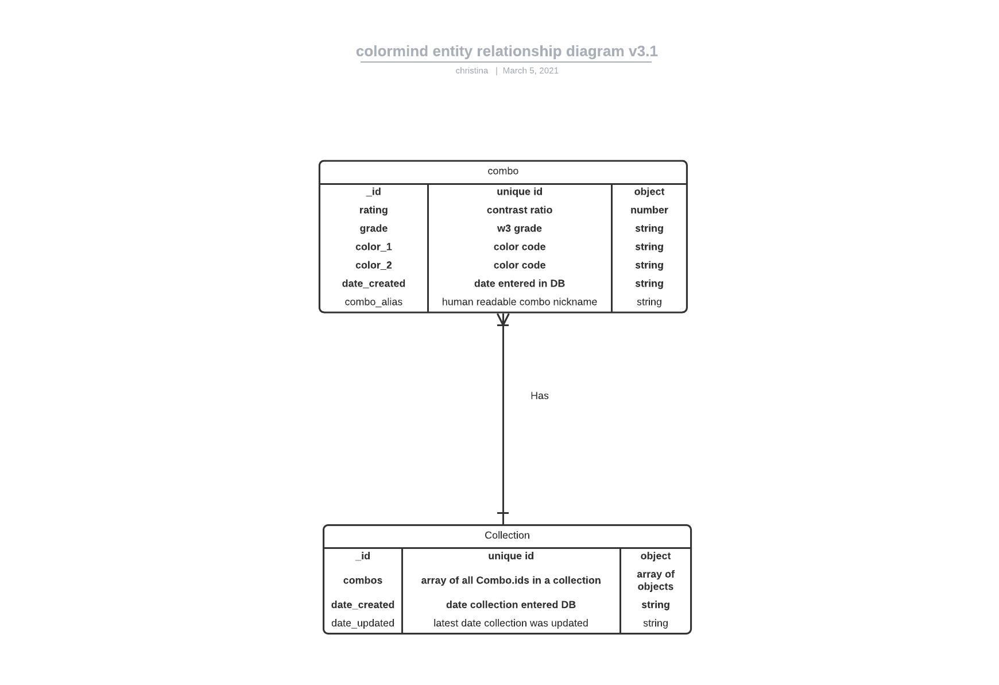
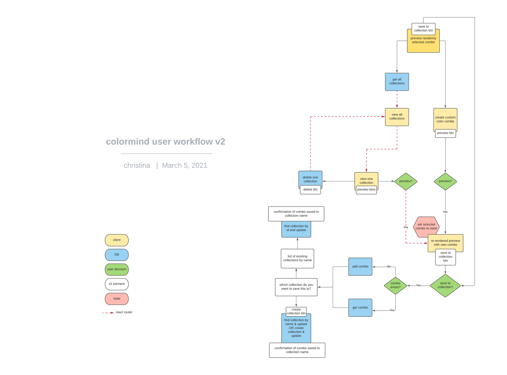

# Colormind 

## Project status: Launched March 5, 2021
### By: Christina Padilla

### [Portfolio](https://christinapadilla.com) | [GitHub](https://github.com/hipstina) | [LinkedIn](https://linkedin.com/in/hipstina)
***

### **Description** 
Colormind is a tool for choosing the best combination of colors that are already part of your brand's color palette. Simple enter in two colors from your brand's color palette and their contrast score. If you like a combo, save it to the collection. You can also view a curated selection of accessible color palettes in the Colormind collection.

### **Technologies Used**
* React
* CSS
* MongoDB
* Express/Node


### **Getting Started**
To get started, clone this repo to your local machine.
```
$ git clone https://github.com/hipstina/colormind.git
```

Download the dependencies for the server
```shell
$ cd colormind
$ npm i 
```

Download the dependencies for client
```shell
$ cd client
$ npm i
```

### **Screenshots**






### **Future Updates**
Track the development of this project on Trello: https://trello.com/b/B06jilKW/p2


### **Credits**
[get-contrast](https://github.com/johno/get-contrast) - A small package for getting the contrast ratio and WCAG score of common color inputs  

Wireframe built with [whimsical.com](https://whimsical.com)

Diagrams built with [Lucid](https://lucid.app/)

[@ahonore42](https://github.com/ahonore42) & [@anpato](https://github.com/anpato) for help with React

This project was inspired by:
+ [Matthew Deeprose's accessible color palette matrix & webinar](https://mle.southampton.ac.uk/bb/BbTLCEUR/kent/index.html)
+ [Coolors contrast checker](https://coolors.co/contrast-checker/112a46-acc8e5)
+ [jxnblk contrast checker](https://colorable.jxnblk.com/440e63/bef59f)